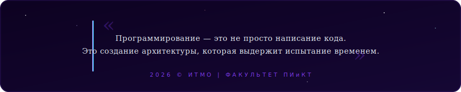

<div align="center">

<!-- ═══════════════════════════════════════════════════════════════════
     🌌 ANIMATED COSMIC HEADER BANNER
     ═══════════════════════════════════════════════════════════════════ -->



<br>

<!-- ═══════════════════════════════════════════════════════════════════
     ⚡ DYNAMIC BADGE STRIP
     ═══════════════════════════════════════════════════════════════════ -->

[](https://openjdk.org/)
[](https://openjfx.io/)
[](https://www.postgresql.org/)
[]()
[]()
[]()

<br>

<!-- ═══════════════════════════════════════════════════════════════════
     📄 REPORT BUTTON — PREMIUM DESIGN
     ═══════════════════════════════════════════════════════════════════ -->

[-FF0000?style=for-the-badge&logo=adobeacrobatreader&logoColor=white)](https://drive.google.com/file/d/1XvAEiTXSP0YNOqxxmy2f6gP8AtnSTmRJ/view?usp=sharing)

<br>

<samp><b>Современное многопоточное клиент-серверное приложение на JavaFX</b></samp>
<br>
<samp>NIO Architecture • PostgreSQL • Real-time Sync • 4 Languages</samp>

</div>

<!-- ═══════════════════════════════════════════════════════════════════ -->

<!-- ═══════════════════════════════════════════════════════════════════ -->

##  &nbsp;О проекте

> **Данный репозиторий — финальная (восьмая) лабораторная работа по программированию.**
>
> Проект эволюционировал из простого консольного приложения в **полноценную Enterprise-систему** с чистой архитектурой, безопасным сетевым взаимодействием, многопоточностью и современным UI/UX.

<br>

<!-- ═══════════════════════════════════════════════════════════════════ -->

<!-- ═══════════════════════════════════════════════════════════════════ -->

##  &nbsp;Ключевые особенности

<table>
<tr>
<td width="50%" valign="top">

### 🎨 &nbsp;Современный интерфейс

<samp>Pure JavaFX • No FXML • Programmatic UI</samp>

- Интерфейс создан **программно** для максимальной гибкости
- Стильный **Dark Mode** в стиле `shadcn/ui`
- Интерактивные диалоги, **Toast-уведомления**
- Встроенный терминал с подсветкой синтаксиса

</td>
<td width="50%" valign="top">

### ⚡ &nbsp;Высокопроизводительный сервер

<samp>Java NIO • Selector • Non-blocking I/O</samp>

- Неблокирующая архитектура **Java NIO**
- `ForkJoinPool` — чтение данных
- `FixedThreadPool` — бизнес-логика
- `CompletableFuture` — асинхронный конвейер
- `ConcurrentSkipListSet` — потокобезопасность

</td>
</tr>
<tr>
<td width="50%" valign="top">

### 🌍 &nbsp;Интернационализация i18n

<samp>4 Locales • Live Switch • EventBus Pattern</samp>

- **Русский** 🇷🇺 • **Словацкий** 🇸🇰 • **Албанский** 🇦🇱 • **English** 🇨🇦
- Мгновенное переключение **без перезапуска**
- Паттерн **EventBus** для обновления UI
- Автоформатирование чисел и дат

</td>
<td width="50%" valign="top">

### 🔐 &nbsp;Безопасность & JDBC

<samp>PostgreSQL • SHA-384 • PreparedStatement</samp>

- Реляционная СУБД **PostgreSQL**
- Хэширование паролей: **SHA-384**
- Защита от **SQL-инъекций**
- Строгое разграничение прав доступа

</td>
</tr>
</table>

<br>

<div align="center">
<table>
<tr>
<td align="center" width="100%">

### 📡 &nbsp;Живая синхронизация & Визуализация

<samp>Real-time Polling • Canvas Radar • Stream API</samp>

> 🔄 **Auto-refresh** каждые 3 сек через `ScheduledExecutorService` + `Platform.runLater()` &nbsp;•&nbsp;
> 🎯 **Интерактивный Радар** с анимацией на Canvas &nbsp;•&nbsp;
> 🔍 **Live Search** — мгновенная фильтрация через **Stream API**

</td>
</tr>
</table>
</div>

<br>

<!-- ═══════════════════════════════════════════════════════════════════ -->

<!-- ═══════════════════════════════════════════════════════════════════ -->

##  &nbsp;Архитектура и Паттерны

<div align="center">



</div>

<br>

<!-- ═══════════════════════════════════════════════════════════════════ -->

<!-- ═══════════════════════════════════════════════════════════════════ -->

##  &nbsp;Технологический стек

<div align="center">
<table>
<tr>
<td align="center" width="140">

<br><b>Java 21</b>
<br><sub>Core Platform</sub>
</td>
<td align="center" width="140">

<br><b>PostgreSQL</b>
<br><sub>Database</sub>
</td>
<td align="center" width="140">

<br><b>JavaFX CSS</b>
<br><sub>Styling</sub>
</td>
<td align="center" width="140">

<br><b>IntelliJ IDEA</b>
<br><sub>IDE</sub>
</td>
<td align="center" width="140">

<br><b>Git</b>
<br><sub>Version Control</sub>
</td>
</tr>
</table>
</div>

<br>

<!-- ═══════════════════════════════════════════════════════════════════ -->

<!-- ═══════════════════════════════════════════════════════════════════ -->

##  &nbsp;Команда разработчиков

<div align="center">



</div>

<br>

<!-- ═══════════════════════════════════════════════════════════════════ -->

<!-- ═══════════════════════════════════════════════════════════════════ -->

##  &nbsp;Быстрый старт

```bash
# 1️⃣  Клонировать репозиторий
git clone https://github.com/islemAZ360/JAVA_LAB_8.git

# 2️⃣  Настроить PostgreSQL (создать БД + таблицы)
psql -U postgres -f scripts/init.sql

# 3️⃣  Запустить сервер
java --module-path /path/to/javafx/lib --add-modules javafx.controls Server

# 4️⃣  Запустить клиент
java --module-path /path/to/javafx/lib --add-modules javafx.controls Client
```

<br>

<!-- ═══════════════════════════════════════════════════════════════════ -->

<!-- ═══════════════════════════════════════════════════════════════════ -->

##  &nbsp;Структура проекта

```
JAVA_LAB_8/
├── 📂 src/main/java/
│   ├── 📂 client/             # 🖥️  Клиентская часть
│   │   ├── 📂 gui/            #     JavaFX интерфейс
│   │   │   ├── components/    #     UI-компоненты (Button, Table, Input...)
│   │   │   ├── pages/         #     Страницы приложения
│   │   │   ├── core/          #     Messages, Theme, CssLoader
│   │   │   ├── router/        #     Навигация между страницами
│   │   │   └── integration/   #     Шлюзы к серверу
│   │   └── Terminal.java      #     Консольный клиент
│   ├── 📂 server/             # ⚙️  Серверная часть
│   │   ├── Server.java        #     NIO Selector + Event Loop
│   │   ├── RequestHandler.java#     Обработка команд
│   │   └── 📂 repository/     #     JDBC → PostgreSQL
│   └── 📂 common/             # 📦  Общие модули
│       ├── dto/               #     Request, Response, StatusCode
│       ├── model/             #     HumanBeing, Car, Coordinates
│       └── utils/             #     Валидация, IO утилиты
├── 📂 src/main/resources/
│   ├── 📂 static/css/         # 🎨  CSS-стили (Dark Theme)
│   ├── 📂 config/             #     config.properties
│   └── 📂 static/icons/       #     Иконки и графика
├── 📂 scripts/                # 🔧  SQL скрипты инициализации
├── 📂 lib/                    # 📚  Зависимости (Log4j2, JDBC)
└── 📂 logs/                   # 📋  Логи сервера
```

<br>

<!-- ═══════════════════════════════════════════════════════════════════ -->

<div align="center">



<br><br>

[](https://github.com/islemAZ360/JAVA_LAB_8)
&nbsp;
[](https://github.com/islemAZ360/JAVA_LAB_8)
&nbsp;
[](https://github.com/islemAZ360/JAVA_LAB_8)

</div>
